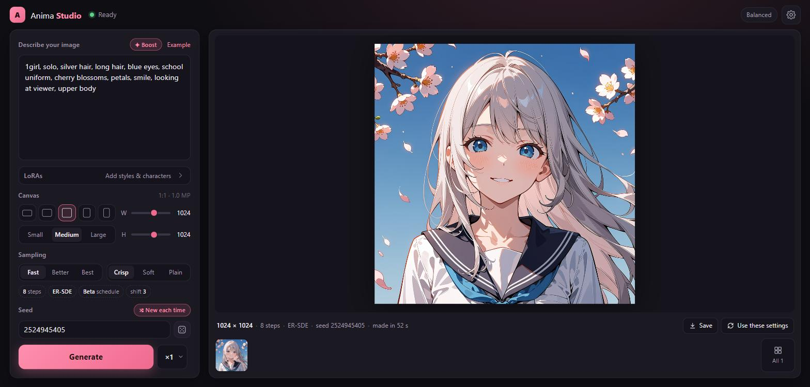

# Anima Studio

Runs [Anima](https://huggingface.co/circlestone-labs/Anima), CircleStone Labs' 2B anime
text-to-image model, **entirely in the browser** on WebGPU. The weights are downloaded once,
cached in the browser's Origin Private File System, and every later visit starts straight
from the cache. Prompts and images never leave the page.

**Live demo: [sm079.github.io/anima-studio](https://sm079.github.io/anima-studio/)** (recent Chrome or
Edge on a computer with a graphics card; the first visit downloads 2–5 GB)

There is no ONNX/runtime dependency. The inference engine is a small set of hand-written
WGSL kernels (`app/gpu/`) that run the quantized weights directly.



- Every released version: Turbo v1.1 / v1.0 (fast, 8–12 steps), Aesthetic v1.1 / v1.0 / v1.0b
  and Base v1.0 (guidance with a negative prompt, 30–50 steps), each with its own sampler presets
- Three download sizes (5.1 / 2.9 / 2.0 GB) from BF16, INT8 and W4A8 builds of the model and
  text encoder, quantized offline in ComfyUI's formats
- Numerically checked against an independent PyTorch implementation, stage by stage
- Live previews, a generation queue, seeds that match ComfyUI, and a session gallery
- LoRAs from Hugging Face or disk, applied as a runtime low-rank path on top of quantized weights
- Runs in a Web Worker; resumable downloads; no server beyond static hosting

## Quick start

The app is static files (`index.html` and `app/`), so any static host works. Pushing to `main`
publishes them to GitHub Pages through `.github/workflows/pages.yml`. The model files are
downloaded from Hugging Face (see [Where the model files live](#where-the-model-files-live)).

```bash
python tools/serve.py                 # http://127.0.0.1:8080/ (any static server works)
```

Open the page in a WebGPU browser (recent Chrome or Edge), pick a download and press
**Download & start**. After the first download, the app loads from the browser's cache.

To rebuild the weights yourself:

```bash
pip install torch safetensors huggingface_hub tokenizers
python tools/build_assets.py          # one-time: download, quantize, pack -> models/
# then open http://127.0.0.1:8080/?models=./models/
```

## What gets built (once, offline)

`tools/build_assets.py` turns the official ComfyUI split files into web assets:

| file | contents |
|---|---|
| `anima-<variant>.<precision>.safetensors` | DiT + LLM adapter |
| `qwen3-0.6b.<precision>.safetensors` | Qwen3-0.6B text encoder |
| `qwen-image-vae-decoder.safetensors` | Qwen-Image (Wan 2.1) VAE, decoder only, re-laid out for the GPU (48 MiB) |
| `tokenizers/` | Qwen and T5 tokenizer JSON |
| `manifest.json` | components, file sizes, measured fidelity, sampler defaults |

The diffusion model and the text encoder are built in three precisions each. Users pick
both independently in the app, trading fidelity for download size and GPU memory:

| precision | DiT | TE | what is quantized |
|---|---|---|---|
| **BF16** | 3.90 GiB | 1.11 GiB | nothing (original weights) |
| **INT8** | 2.26 GiB | 585 MiB | block linears int8 + ConvRot; TE embedding per-row int8 |
| **W4A8** | 1.59 GiB | 415 MiB | "mixed": block linears W4A8 + ConvRot, first block int8 (DiT: last block int8 too) |

In every quantized TE the last layer stays bf16. It feeds the output norm directly, and
quantizing it caused most of the conditioning error: hidden-state error drops from 12% to 3% for
+30 MB.

The default is INT8 + INT8 (2.9 GB total); the smallest combination, W4A8 + W4A8, is 2.0 GB.
Quantization reduces download size and VRAM, not time. The engine computes in fp32 and decodes
weights inside the matmul, so all precisions run at about the same speed (DiT forward at 1024²,
RTX 4060 Laptop: INT8 5.21 s, BF16 5.26 s, W4A8 5.62 s).

**Measured fidelity** (`tools/measure_quality.py`: 3 prompts × fixed seeds, 768², Turbo, 8 Euler
steps; PSNR of the final image against the all-BF16 output):

| DiT | TE | image PSNR vs BF16 | text-conditioning error |
|---|---|---|---|
| INT8 | BF16 | 19.6 dB | 0 |
| BF16 | INT8 | 21.0 dB | 2.3% |
| INT8 | INT8 | 20.5 dB | 2.3% |
| W4A8 | BF16 | 11.4 dB | 0 |
| BF16 | W4A8 | 10.7 dB | 20% |
| W4A8 | W4A8 | 10.3 dB | 20% |

Diffusion amplifies tiny weight differences into changed details, so even visually equivalent
images score far below "lossless" PSNR. In the comparison images, every precision produces clean,
high-quality output. INT8 keeps the BF16 composition with small detail changes. W4A8 on either
component sometimes reinterprets a prompt: in one test prompt, a café interior became an
isometric diorama.

The W4A8 DiT follows the reference "mixed" scheme, with attention and MLP both in 4-bit. A
fidelity-leaning alternative keeps attention in int8 and only the MLPs in 4-bit (1.86 GiB). In the
same test that stopped the reinterpretation (café prompt 6.4 → 14.3 dB):
`python tools/build_assets.py --dit w4a8 --w4-attn int8 --force`.

`--variants all` builds every released version (`--variants turbo-v1.1 aesthetic-v1.1 …` picks
some). Each manifest entry records the model's family (`turbo`, `aesthetic`, `base`) and its sampler
defaults. Base v1.0 is saved with the training script's `net.` key prefix; the build renames it
to ComfyUI's `model.diffusion_model.` like the other versions. A subset of precisions:
`--dit int8 w4a8 --te int8`. Rerun `tools/measure_quality.py` afterwards to
refresh the fidelity figures in the manifest.

### Quantization formats

The quantized tensors use the ComfyUI `comfy_quant` layout, the same formats as the
reference checkpoints
([int8 convrot](https://huggingface.co/Comfy-Org/MiniMax-H3/blob/main/diffusion_models/minimax_h3_ref2va_pruned_int8_convrot.safetensors),
[w4a8 mixed](https://huggingface.co/Kijai/MiniMax-H3-experimental/blob/main/minimax_h3_ref2va_pruned_w4a8_mixed.safetensors)),
and `tools/quant.py` reproduces their quantizers.

- **`int8_tensorwise` + ConvRot.** Each weight row is rotated by a 256-point regular
  Hadamard matrix (`W·Hᵀ` per group of 256 inputs), then quantized to int8 with one scale
  per output channel. At runtime the activations get the same rotation, so `x·Wᵀ = (x·H)·W_rotᵀ`.
- **`asym_w4a8_int8` + ConvRot.** The rotated weights are split into groups of 16. Each group
  gets a 4-bit code into a 16-level Lloyd-Max codebook and an fp8-e4m3 group scale, and the
  codes decode onto an int8 grid that has a per-channel scale.

`tools/quant.py` matches comfy_kitchen's eager implementation bit for bit: packed codes,
scales and codebook are identical. The GPU kernels decode the weights inside the matmul
tile loader, so weights stay 8- or 4-bit in VRAM. Activations stay in fp32 (the DiT residual
stream needs it), so no activation quantization error is introduced.

Precision-sensitive parts stay bf16: adaLN, embedders, final layer, LLM adapter and norms.

## LoRAs

Paste a Hugging Face link to a LoRA's `.safetensors` file (its `/blob/` page or `/resolve/`
download link) in the **LoRAs** view. Hugging Face serves files and its API with CORS headers,
so the page talks to it directly, with no helper server. Before downloading, the app reads just the
file's header (a Range request) to check that it is a LoRA and that its layer names match
Anima, and reads the repo card for a preview image and trigger words (`instance_prompt`). It
then downloads the file once into browser storage. Each LoRA row has a strength slider
(−1 to 2; double-click resets to 1), a trigger-word insert, an on/off toggle (click the
thumbnail) and a link to its page. [Anima LoRAs on Hugging Face](https://huggingface.co/models?other=base_model:adapter:circlestone-labs/Anima).

A Hugging Face access token (read-only is enough) is optional. It can be entered on the first-run
screen or in **Settings**, and is used for model downloads (Hugging Face gives signed-in downloads
higher limits) and for gated or private LoRA repos. It is stored only in the browser and sent only
to huggingface.co. Any local `.safetensors` LoRA can also be added from disk.

How it runs: LoRAs are **not merged** into the (quantized) weights. Each targeted linear gets
a low-rank side path, `y = W·x + s·B(A·x)`, added inside the matmul epilogue. That makes
strength changes instant, and quantization never has to be redone. For ConvRot-quantized layers
`A` is pre-rotated (`A·H`) so it takes the same rotated input. Both PEFT (`lora_A/lora_B`) and kohya
(`lora_down/lora_up` + `alpha`) naming are supported, for the DiT, the LLM adapter and the text
encoder. LoKr/LoHa/DoRA are reported as unsupported. Verified against PyTorch with two LoRAs
at once (both formats, merged into the weights on the reference side): DiT output rel. error 7e-5,
8-step final latent 2.7e-3. Cost with those two LoRAs (788 layers): about +20% per step.

## Where the model files live

The contents of `models/` are published in a Hugging Face model repo, and `MODELS_URL` in
`app/main.js` points at it, **pinned to a commit** (`…/resolve/<commit>/`). Browsers cache the
files by name, so pinning keeps returning visitors from mixing old and new files: after uploading
new weights, update the commit in `MODELS_URL`. Hugging Face allows cross-origin reads and HTTP
Range requests, so downloads come straight from its CDN and interrupted downloads resume.

`?models=<url>` overrides the location, e.g. `?models=./models/` for a local build. Any other
host must allow CORS and should support Range requests.

## Architecture notes

| part | implementation |
|---|---|
| Tokenizers | Qwen2 BPE + T5 Unigram through the vendored `@huggingface/tokenizers` (ids verified against Python `tokenizers`). ComfyUI `(text:1.2)` weights apply to the T5 side, as in ComfyUI. |
| Text encoder | Qwen3-0.6B, 28 layers, GQA 16/8, final hidden state after the last norm |
| LLM adapter | 6 blocks (self-attn over T5-token queries, cross-attn to Qwen3 states), output zero-padded to 512 tokens |
| DiT | Cosmos-Predict2 MiniTrainDIT, 28 blocks, dim 2048, AdaLN-LoRA, 3D RoPE (NTK ×4 on h/w), fp32 residual stream |
| Sampling | Flow matching, shift 3, ComfyUI "simple" and "beta" schedules (beta verified against scipy). Presets per model family, from the model card. **Turbo**: CFG 1 (one DiT pass per step, no negative prompt); **Detail** Fast/Better/Best = 8/10/12 steps; **Style** Crisp = ER-SDE + beta (default), Soft = Euler A, Plain = Euler. **Aesthetic / Base**: classifier-free guidance, `uncond + cfg·(cond − uncond)`, two DiT passes per step, with an editable negative prompt (the card's recommendation; without score tags for Aesthetic); **Detail** 30/40/50 steps; **Style** Crisp = ER-SDE + simple, Soft = Euler A, Plain = Euler; CFG 4 (Aesthetic) / 4.5 (Base), half a point more for Euler A. Each family keeps its own settings when switching versions. |
| Preview | After each step, the model's current guess of the final image is projected from the 16 latent channels to RGB with ComfyUI's fixed latent→RGB matrix (1/8 resolution, a few ms) instead of running the VAE. That's why previews are soft and colors approximate. |
| Noise | port of `torch.randn` on the CPU generator, so seeds match ComfyUI's initial noise |
| VAE | Wan 2.1 decoder. For one frame the causal 3D convs reduce to 2D convs (done at build time); NHWC implicit-GEMM convs with a fused 2× upsample |

Engine layout:

- `app/gpu/gemm.js` — the tiled GEMM generator: 128×128 tiles with 8×8 outputs per thread
  (64×64 for small problems), register prefetch of the next k-tile, and vectorized loads when
  aligned. Everything is fully unrolled with constant register indexing, because compilers spill
  dynamically indexed arrays. It handles bf16 / int8 / w4 weights decoded in the tile loader,
  strided and batched f32 for attention, and implicit im2col for convs, with fused bias,
  GELU/SiLU and gated-residual epilogues. It uses only the guaranteed 16 KB of workgroup memory.
- `app/gpu/kernels.js` — fused flash attention (online softmax, no score matrix in memory;
  head size 64/128), LayerNorm + adaLN with the ConvRot Hadamard fused in, fused q/k RMSNorm +
  RoPE, and the remaining softmax / norm / RoPE / Hadamard kernels. The causal/GQA text encoder
  and the VAE's single 384-dim head use the chunked attention path.
- `app/models/` — Qwen3, the DiT and LLM adapter, and the VAE decoder. The DiT stacks q/k/v
  into one GEMM, and computes cross-attention keys/values once per prompt for all 28 blocks.
- `app/worker.js`, `app/engine.js` — the engine runs in a Web Worker so the page stays
  responsive; it falls back to the page if a browser lacks WebGPU in workers (`?engine=page`
  forces it).
- `app/pipeline.js`, `app/samplers.js`, `app/store.js` — orchestration, samplers, and the
  resumable OPFS download cache.

## Verifying the engine

`tools/reference.py` is an independent PyTorch implementation that reads the same web assets.
It produces an image and dumps intermediate tensors. `tools/check.html` runs each WebGPU
component on the same inputs and compares:

```bash
python tools/reference.py --dit int8 --te int8 --dump out/dump_int8 --out out/ref.png
python tools/serve.py   # then open http://127.0.0.1:8080/tools/check.html
```

Results on an RTX 4060 Laptop GPU (Chrome, 768×768), relative L2 error of the WebGPU engine
vs the PyTorch reference running the *same* weights:

| stage | BF16 + BF16 | INT8 + INT8 | W4A8 + W4A8 |
|---|---|---|---|
| Qwen3 hidden states | 2.6e-6 | 3.7e-6 | 3.2e-6 |
| adapter context | 2.9e-6 | 3.2e-6 | 3.2e-6 |
| DiT denoised output (1 step) | 2.4e-5 | 2.4e-5 | 2.0e-5 |
| final latent after 8 steps | 1.2e-2 | 3.5e-3 | 9.9e-3 |
| decoded image | | 1.5e-3 (8-bit rounding) | |

The 8-step figures are fp32 accumulation-order drift, compounded across steps. `?only=full`
runs the complete sampling loop through the real pipeline.

## Performance and requirements

- A WebGPU browser and a GPU with roughly (weights + activations) 3–4 GB free for INT8/W4A8,
  or 6–7 GB for BF16, at 1024×1024. The VAE decode at large sizes is the activation peak.
- RTX 4060 Laptop GPU, INT8, DiT forward (= one step): 768×768 **2.4 s**, 1024×1024 **5.2 s**
  (profile-guided GEMM tuning, kernel fusion and fused attention brought these down from 3.65 s
  and 7.2 s). Guided models (Aesthetic, Base) run two forwards per step, so a 30-step image takes
  60 forwards, ~5.3 min at 1024² (~2.5 min at 768²). An 8-step Turbo image at 1024² is ~44 s
  (8 × 5.2 s plus ~1.5 s VAE and prompt encoding, in a visible tab; hidden tabs are throttled by
  the browser). Measured with
  `tools/profile.html` (per-kernel GPU timings) and `tools/bench.html` (GEMM microbenchmark).
- Where the time goes at 1024² (INT8): linears ~66% at ~3.9 TFLOP/s (cuBLAS f32 without tensor
  cores reaches 6.8 on this GPU), fused attention ~31% at 2.7 TFLOP/s, everything else ~3%.
- Loading cached weights onto the GPU takes ~15–20 s. Switching only the text encoder keeps the
  DiT on the GPU.
- Persistent storage: the app calls `navigator.storage.persist()` so the browser does not
  evict the cached weights.

## Optional: WebNN engine (experimental)

The image model can run through [WebNN](https://www.w3.org/TR/webnn/), the browser's built-in
neural-network API, instead of the hand-written WebGPU kernels. The browser hands the whole
diffusion step to the platform's ML stack (on Windows, Windows ML / DirectML), which can use the
GPU's fp16 tensor cores. The WebGPU kernels compute in fp32 and can't use them. The text
encoder, LLM adapter and VAE always stay on WebGPU. WebGPU remains the default. WebNN is opt-in.

**Enable WebNN in the browser.** As of Chrome 147–149 WebNN is in an origin trial and otherwise
behind a flag:

1. Open `chrome://flags/#web-machine-learning-neural-network` (Edge:
   `edge://flags/#web-machine-learning-neural-network`).
2. Set **WebNN API** to **Enabled**.
3. Relaunch the browser.

(Command-line alternative: `--enable-features=WebMachineLearningNeuralNetwork`.) Then open
**Settings → Engine** in the app and pick **WebNN (experimental)**. If WebNN isn't available,
the option is disabled and the settings show these steps. `?backend=webnn` selects it from
the URL.

**What to expect** (RTX 4060 Laptop, Chrome/Edge 154, INT8 DiT, 768×768):

| | WebGPU (default) | WebNN fp16 |
|---|---|---|
| one step (DiT forward) | 2.4 s | **0.85–0.95 s** |
| first image at a new size | shaders compile once | + ~35–45 s to build the WebNN graph |
| DiT output vs PyTorch reference (1 step) | 2.4e-5 | 8.0e-3 |
| final latent after 8 steps | 3.5e-3 | 2.0e-1 |
| final image vs PyTorch (same weights) | | 24.6 dB PSNR, visually the same picture |

For scale: INT8 vs BF16 weights is 19.6 dB, so the WebNN rounding changes less than the
default quantization does.

- Memory: building the graph copies the weights through system RAM, and the graph needs more
  GPU memory than the WebGPU engine (about 3 GB for the INT8 DiT at 768²). On a laptop where the
  browser gives WebGPU the integrated GPU, a 1024² image (VAE decode in shared memory while
  WebNN holds its graph) froze the system in testing. Prefer smaller canvases, and don't
  use WebNN on machines that are tight on RAM or VRAM.

- WebNN graphs have fixed shapes, so a graph is built per image size, prompt length (over 512
  tokens) and LoRA set. Changing a LoRA's strength doesn't rebuild the graph, but adding or
  removing a LoRA does. Chrome doesn't support WebNN constant tensors yet, so every rebuild
  re-reads the weights from browser storage.
- Numerics: linears and attention run in fp16. The residual stream, norms and adaLN stay fp32,
  and so do the timestep and adaLN-modulation linears. They run on a single row, but their
  outputs scale the whole residual stream. In fp16 they made the one-step error 6.7e-2
  (fp32 attention alone didn't help: 6.6e-2).
  With `precision=float32` (`tools/check.html?backend=webnn&precision=float32`) the same graph
  matches the reference to 3.9e-6, which confirms the graph itself. It is ~2× slower than the
  WebGPU engine, so it's only for checking.
- Quantized weights stay int8 on the device (`dequantizeLinear` in the graph). W4A8 codes are
  decoded to their int8 grid on load, so a W4A8 download uses about as much memory as INT8
  under WebNN. BF16 weights become fp16.
- If loading with WebNN fails, the app switches back to WebGPU and says so.

Code: `app/webnn/dit.js` (graph builder and runner) and `app/webnn/support.js` (detection).
`tools/check.html?backend=webnn&only=dit` compares one step against the reference dump.

## License

The model weights are under the CircleStone Labs Non-Commercial License; see the
[model card](https://huggingface.co/circlestone-labs/Anima). Generated images may be used
commercially according to the model card. The converted weights the app downloads
([sm079/anima-studio](https://huggingface.co/sm079/anima-studio)) are modified, unofficial
versions of Anima, published for non-commercial use with the license and the required attribution
notice. The vendored tokenizer library is Apache-2.0.
